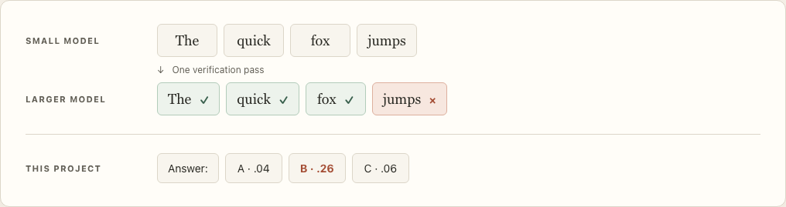
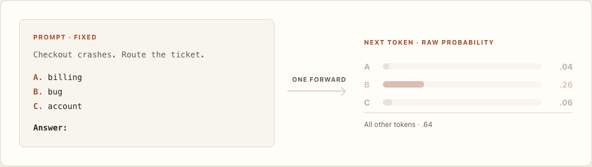
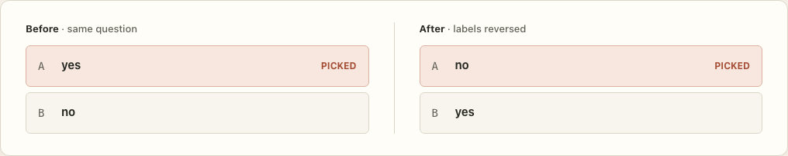

<p align="center">
  
</p>

# myNameisJevToo

**Turn an open decoder-only language model into a typed decision API.** Load a model with MLX or connect a running `llama-server`, then call `POST /v1/systemone` with a state and questions. The server returns `choice`, `noul`, and `score` answers using the [published request and answer shape](https://docs.typesafe.ai/api).

The name is a joke and a nod to TypeSafe AI. This is an independent project, unaffiliated with TypeSafe AI; the wordmark above is drawn for this repository.

## What we measured

The interface is cheap; **answer quality depends on the base model and the task**. On the 231 public JevBench items (48 easy, 72 standard, 111 hard), the same readout was run on five legs: a 2B MLX model, a ternary 27B, and three Qwen3.8-27B quantisations. The harness reads the option letters' probability mass in one forward pass; nothing is generated.

| Public JevBench tier or axis | Items | MiniCPM5-2B MLX 4-bit | Ternary-Bonsai-2-27B PQ2_0 (6.7 GB) | Qwen3.8-27B MLX 4-bit | Qwen3.8-27B GGUF Q4_K_M | Qwen3.8-27B GGUF Q8_0 |
|---|---:|---:|---:|---:|---:|---:|
| Easy | 48 | 77.1% | 100.0% | 100.0% | 100.0% | 100.0% |
| Standard | 72 | 50.0% | 86.1% | 94.4% | 97.2% | 97.2% |
| Hard | 111 | 39.6% | 60.4% | 69.4% | 74.8% | 73.9% |
| Intelligence axis | — | 27.4 | 67.2 | 77.6 | 82.6 | 82.0 |
| Calibration axis | — | 40.2 | 81.2 | 86.9 | 77.2 | 86.1 |
| Speed axis | — | 73.6 | 66.3 | 67.4 | 65.9 | 66.4 |
| Score over three axes | — | ≈13 | 71.2 | 76.9 | 74.9 | 77.7 |
| Hard-tier ECE (lower is better) | 111 | 0.2989 | 0.0940 | 0.0655 | 0.1139 | 0.0693 |

Every leg saw the same 231 public items, scored with JevBench's own formulas: chance-corrected per tier, weights easy 0.14 / standard 0.28 / hard 0.30, intelligence as the weighted mean of the chance-corrected tier scores, calibration from hard-tier ECE, and speed from latency under JevBench's own-server rule (raw ×2 + 0.15 s).

### The readout, not the model, is the ceiling on hard items

Of the 111 hard items, the one-pass readout got 29 wrong. Re-running those same rendered prompts with a thinking budget (greedy, up to 4,000 tokens) answered **23 of the 29 correctly**. On the Q8_0 leg that moves the hard tier from 82/111 (73.9%) to 105/111 (94.6%), chance-corrected 60.6 to 91.9, and the intelligence axis from 82.0 to about **95.0**.

That ~95.0 is an **upper bound, not a measured reasoned score**. Only the 29 failures were re-attempted, so it assumes reasoning never breaks an item the readout already had right. Three of the 29 stopped at the 4,000-token cap mid-reasoning. The true reasoned figure requires running all 111 hard items with reasoning, which we have not done. The per-item outcomes of those 29 reruns are committed as [`benchmarks/results/reasoned_hard/reasoned_summary.json`](benchmarks/results/reasoned_hard/reasoned_summary.json); the raw transcripts are not committed, because a transcript quotes the item it answers and this repository does not redistribute JevBench task text ([why](THIRD-PARTY.md)).

### No precision ladder on intelligence

The three 27B legs are statistically indistinguishable on intelligence. McNemar, paired on the hard tier: Q8_0 vs Q4_K_M p = 1.000, Q8_0 vs MLX 4-bit p = 0.267, Q4_K_M vs MLX 4-bit p = 0.238. With 111 hard items, one item is 0.9% raw and 0.57 intelligence points, and Q8_0 vs Q4_K_M is a **one-item difference** (82 vs 83 of 111). Do not read a real spread into these three numbers.

### Calibration follows the quant scheme, not the bit width

MLX 4-bit reaches **86.9**, about level with GGUF Q8_0 at **86.1**, while GGUF Q4_K_M sits at **77.2**. The spread is between the GGUF and MLX quantisation schemes, not between 4-bit and 8-bit. An earlier version of this document generalised from that one Q4_K_M pair into "calibration is the precision-sensitive axis". That claim was wrong, and the MLX 4-bit and GGUF Q8_0 legs contradict it.

### Where the hard items fail

Hard-tier accuracy by family on Q8_0:

| Family | Correct | Accuracy |
|---|---:|---:|
| temporal_numeric | 6/15 | 40.0% |
| probability | 6/10 | 60.0% |
| tradeoff | 4/6 | 66.7% |
| long_policy | 14/19 | 73.7% |
| judge_hard | 13/17 | 76.5% |
| multi_hop | 14/18 | 77.8% |
| trap | 7/8 | 87.5% |
| ambiguous | 7/7 | 100.0% |
| adversarial | 6/6 | 100.0% |
| routing_hard | 5/5 | 100.0% |

The failures concentrate on arithmetic over dates and amounts, and on probability estimates.

### Latency tracks context, not model size

Ternary-Bonsai is **6.7 GB** against Qwen Q8_0's **27 GB**, and the latency is the same: raw p50 **600 ms** versus **589 ms**, p95 **8.7 s** versus **8.5 s**. The long tail is prefill of the hard items' roughly 3,700-token states, not weight size. Under JevBench's own-server adjustment the Q8_0 leg is p50 1.33 s and p95 17.19 s.

### The state-blind control

The **state-blind control** replaces the state with a placeholder while leaving the options intact. On hard items the 27B legs keep 71% to 73% of their accuracy with the state removed (Q8_0 70.7%, Q4_K_M 71.1%, Bonsai 73.1%). The 2B model scored **better without the state (45.9% vs 39.6% with it)**, which is the option-list prior showing through. Its hard-tier score largely reflected those priors; the 27B legs still show real option-list reliance on hard items, but they are no longer ignoring the input.

### Caveats

These are our runs on the **public portions only** (48/72 easy, 72/96 standard, 111/220 hard; the judge tier is not public, so tier weights are renormalised over three tiers). They cannot be read as full-board JevBench scores. The claimed ~95.0 reasoned intelligence is an upper bound from 29 re-attempts, not a full reasoned run. The 2B ran on a Mac mini M4 (16 GB); the 27B legs ran on a Mac Studio M3 Ultra (96 GB). The GGUF legs ran on `llama.cpp`; the Ternary-Bonsai PQ2_0 leg ran on PrismML's prebuilt fork. Results are task-specific and include confident errors.

Two suspected artefacts were probed and ruled out, and are not open questions. A `min_p` effect was disproved: identical top-logprobs with no `min_p`, with `min_p = 0.05`, and with `min_p = 0.0` on both builds. Xing4.0-29B-A4B cannot run on this stack at all; `llama.cpp` reports `unknown model architecture: 'xing4_0'`.

For reference, JevBench's own board lists Jev 1.13.0 at **85.7**, SemIf (Qwen3.5-4B) at **79.0**, and jeff (GLiFormer 400M) at **46.9** intelligence. Those are the vendors' published numbers on the full board, not our measurements, and they are not directly comparable to the public portions above.

The full write-up is at [research.lintlabs.org/jevbench](https://research.lintlabs.org/jevbench). See also [the complete 2B write-up](docs/RESULTS-minicpm5.md), [the method](docs/TECHNIQUE.md), [pitfalls](docs/PITFALLS.md), and the committed per-item records under [`benchmarks/results/`](benchmarks/results/).

## The idea

Speculative decoding gives a useful picture: a small model **drafts token blocks**, and a larger model **checks those tokens** in one verification pass. This is a simplified illustration of that process.

<p align="center">
  
</p>

This project uses the same kind of **probability lookup** for a different question. A prompt lists options and ends at `Answer:`. At that one final position, we read the next-token probabilities of the option letters. There is no text generation or change to the model's weights. The numbers below are illustrative.

<p align="center">
  
</p>

For the fast path, ` A`, ` B`, and ` C` each need to be **one token in the model's tokenizer**. The implementation checks this. Choices support up to 26 lettered options; multi-token labels use a cached-prefix scoring path. [Explore the full explanation](docs/how-it-works.html).

### Why the probabilities need two views

| View | In the example | What it answers |
|---|---:|---|
| **Raw option mass** | `.04 + .26 + .06 = .36` | How much probability landed on valid answer letters? |
| **Share of options** | B: `.26 / .36 ≈ 72%` | Given a valid option, which one wins? |

The remaining `.64` belongs to other tokens in the vocabulary. A **72% share** can therefore coexist with **36% option mass**. Keep both when deciding whether to act. The HTTP `confidence` field is [peakedness](docs/TECHNIQUE.md) of the option shares; the Python library's `Distribution.confidence` is the winner's share. Calibrate thresholds on your own task.

## Run it

```bash
pip install -e ".[mlx]"                     # Apple Silicon / MLX
python -m jevtoo.serve --model openbmb/MiniCPM5-2B-MLX
# Or connect to a running llama-server:
python -m jevtoo.serve --gguf http://127.0.0.1:8080
```

The server listens on `127.0.0.1:8787` by default. The core package uses the Python standard library; MLX is optional. `jev-latest` and `jev-preview` resolve to the loaded model. Set `JEVTOO_API_KEY` or pass `--api-key` to require `Authorization: Bearer ***`

```bash
curl -s http://127.0.0.1:8787/v1/systemone \
  -H 'Content-Type: application/json' \
  -d '{
    "model": "jev-latest",
    "state": "The checkout page crashes every time I pay.",
    "questions": {
      "topic": {
        "type": "choice",
        "instructions": "Route this ticket.",
        "criteria": {"billing": "charges and refunds", "bug": "broken product"}
      },
      "urgent": {"type": "noul", "instructions": "Escalate to a human now?"}
    }
  }'
```

The response contains `model`, `answers`, and `usage`. A choice answer contains `choice`, `probabilities`, and `confidence`; a `noul` answer contains the share assigned to **yes**. A `score` question takes an ordered list of 2–10 levels and returns its expected level on a zero-based scale.

```python
from jevtoo import convert

jev = convert("openbmb/MiniCPM5-2B-MLX")
state = "The checkout page crashes every time I pay."
route = jev.choice(state, "Route this ticket.", ["billing", "bug", "account"])
print(route.choice, route.share, route.raw)

p_yes = jev.noul(state, "Escalate to a human now?")
urgency = jev.score(state, "How urgent?", ["low", "medium", "high"])
print(p_yes, urgency, jev.last.as_dict())
```

Each question is one decision readout. The server can share a common prompt prefix across questions in the same request.

## Check for position bias

A two-option read can reflect the **first letter's position** more than the state. In our MiniCPM5-2B experiment, reversing `yes` and `no` changed which word won while the first slot kept winning.

<p align="center">
  
</p>

| Option order | With state | State withheld |
|---|---:|---:|
| `no`, `yes` | no · 91.5% | no · 94.7% |
| `yes`, `no` | yes · 99.2% | yes · 89.3% |

That test found a position prior in **this model and prompt**. Reorder options and rerun the question before trusting binary decisions. The API's `binary_position_prior` observation marks two-label questions for inspection; it is a warning flag, not a measured bias score.

## Observe a decision

Add `-H 'X-Jev-Observe: 1'` to the request above (or use `?observe=1`). The usual response shape gains an `observability` object with request timing and per-question diagnostics:

| Signal | Use |
|---|---|
| `queue_ms`, `service_ms`, `forward_ms` | Separate lock wait, service time, and model computation. |
| `prefill_ms`, `shared_prefix_tokens` | See when a shared question prefix was reused. |
| `option_mass`, `winner_probability`, `peakedness` | Compare raw option coverage, winning share, and HTTP confidence. |
| `missing_labels` | Detect GGUF labels missing from top-N; the server retries once with a wider window. |
| `binary_position_prior`, `head_mode` | Flag two-label reads; inspect whether a verified last-token head is in use. |

`GET /health`, `GET /v1/models`, and Prometheus `GET /metrics` are on the same port. Responses include `Server-Timing` and `X-Request-Id`; structured server logs exclude prompt text. An MLX server serializes forwards on one Metal lock.

## Reproduce

```bash
python tests/run_tests.py                # no model download
./datasets/fetch_jevbench.sh            # public task items
python benchmarks/binary_flip_test.py    # check order sensitivity
python benchmarks/stateblind.py          # test the state-blind control
python benchmarks/jevbench.py            # public items + reversed pass
```

The Q8_0 and Ternary-Bonsai legs use the same harness and the same 231 public items; their per-item records are `benchmarks/results/jevbench_qwen38_27b_q8_0*.json` and `benchmarks/results/jevbench_ternary_bonsai_2_27b_pq2_0*.json`. The reasoning rerun was ad hoc rather than a committed script; its 29 generations and outcomes are under `benchmarks/results/reasoned_hard/`.

## Project map

- `jevtoo/readout.py`, `jevtoo/decide.py`: probability distribution and typed decisions.
- `jevtoo/backends.py`, `jevtoo/backends_gguf.py`: MLX and llama-server backends.
- `jevtoo/contract.py`, `jevtoo/serve.py`: request contract, local endpoint, metrics.
- `jevtoo/calibrate.py`: calibration and abstention tools.
- `benchmarks/`: experiments, scripts, and per-item results.
- `benchmarks/results/reasoned_hard/`: the 29 hard-item reasoning reruns and their summary.
- `docs/how-it-works.html`: light-theme visual explanation and accessible stills.

## Credits and license

TypeSafe AI originated Jev and the System One framing. [fstandhartinger/jevbench](https://github.com/fstandhartinger/jevbench) published the cross-model benchmark and the scoring formulas; [jev-calibration-audit](https://github.com/jujumilk3/jev-calibration-audit) motivated the state-blind control. OpenBMB publishes the MiniCPM model. More acknowledgments and third-party terms are in [THIRD-PARTY.md](THIRD-PARTY.md).

MIT; see [LICENSE](LICENSE). Model weights are not bundled.
